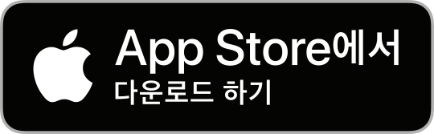
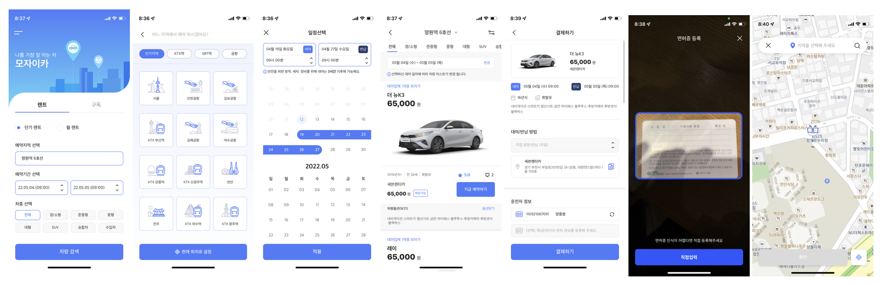
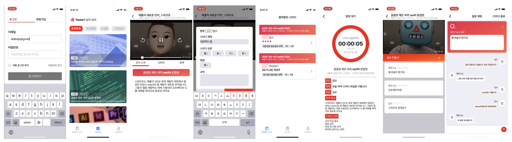
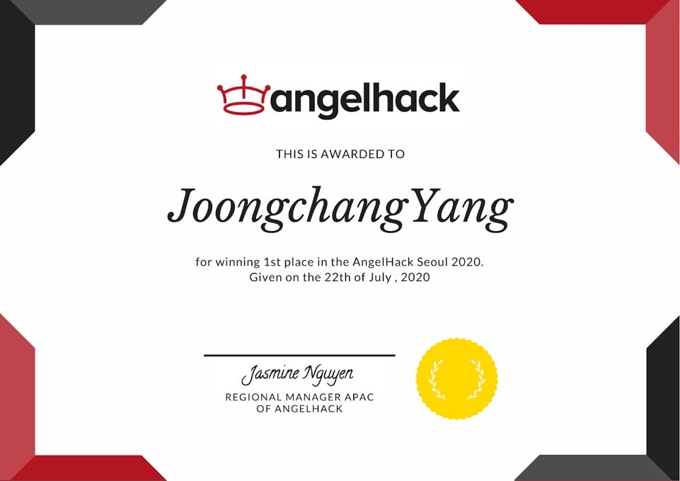
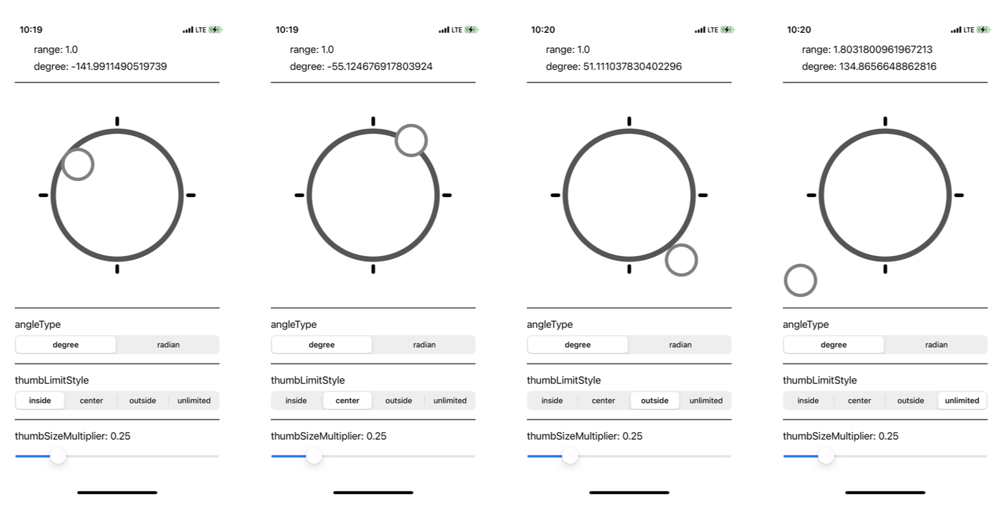
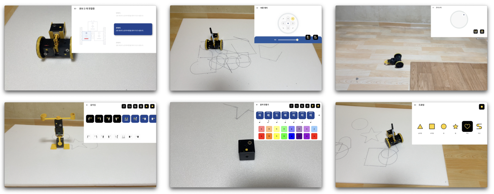
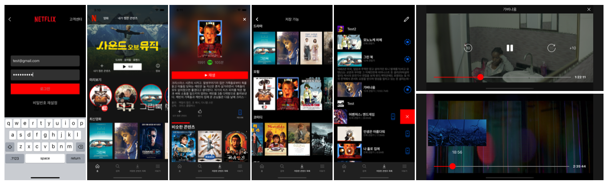

# 양중창

> iOS Developer

- **Email**: didwndckd@gmail.com
- **Phone**: 010-3334-9929
- **GitHub**: https://github.com/didwndckd

## 소개

2년 차 개발자로 현재 캐플릭스에서 iOS 개발자로 근무하며 렌터카 서비스인 모자이카 앱 외 여러 서비스를 개발 및 유지 보수를 진행하고 있습니다.

기본을 중요하게 생각하고 개발에 정성을 들이는 것을 좋아해 생각이 정리되기 전에는 키보드에 손을 올리지 않습니다.

RxSwift와 MVVM 패턴을 사용하여 개발하며 코드 베이스와 스토리보드 두 가지 방법으로 UI 구현이 가능합니다. 현재 iOS 개발자 동료와 Git을 통해 형상 관리를 하고 있으며 코드 리뷰 후 Merge 하는 방식으로 진행하고 있습니다.

## 기술

- 사용 언어: Swift, Objective-C
- 주요 사용 라이브러리: RxSwift, RxCocoa, SnapKit, Moya, Alamofire, Kingfisher
- 기타: Git, Github, GitLab

## 경력

### (주)캐플릭스

> 2020.09.07 ~ 현재

#### 모자이카

원하는 곳에서 렌터카를 픽업하고 반납할 수 있는 렌터카 서비스

- 앱 리뉴얼
  
  - 앱 전체 리뉴얼 작업으로 기획 단계부터 참여하여 모든 화면의 UI와 기능 개선
  
  - Lottie를 사용한 애니메이션 구현
  
  - `UIViewControllerTransitioningDelegate`, `UIViewControllerAnimatedTransitioning`을 사용하여 화면 전환 애니메이션 커스텀
  - FSCalendar의 `FSCalendarCell` 서브 클래싱으로 달력 커스텀 및 렌트 일정 선택 기능 구현
  - OCR SDK를 커스텀 하여 디자인에 맞춰 카드 스캔 기능 구현
  
- MVVM 패턴 적용
  
  - 기존의 VIPER 패턴이 현재 프로젝트와 맞지 않는다고 판단하여 MVVM 패턴으로 리팩터링
  
  - UI와 로직을 좀 더 명확하게 분리하며 가독성과 유지 보수성 향상
  - 개발 속도 향상
  
- 네트워크 통신 모듈 작업

  - Moya를 도입하여 타입 및 케이스별로 명확한 API 관리가 가능하게 함

  - Moya `TargetType` 프로토콜을 채택한 타입과 파싱 할 타입을 전달받아 `Observable<파싱 타입>`을 반환하여 구독할 수 있도록 Request 함수 구현
  - `Observable`을 확장하여 내부 정의 네트워크 에러 타입으로 `onError`를 전달받을 수 있는 `subscribe` 함수 구현

- 메모리 누수 제거

  - 기존 코드의 화면 이동 방식의 결함으로 모든 화면에 순환 참조가 존재하였으나 분석 후 순환 참조 제거

#### 기타

- 제주패스 렌트 iOS 앱 유지 보수
- 카페패스 iOS 앱 유지 보수
- 제주패스 맛집 iOS 앱 유지 보수

## 수상 경력

### AngelHack Seoul 2020

> 2020.07.13 ~ 2020.07.19

AngelHack Seoul 2020에 참가하여 코로나와 같은 재난 격리, 도서 산간 거주 등 불가피한 원격 상황에서도 학습 의지 부여와 완주율을 높이는 교육, 학습 솔루션을 주제로 온라인 스터디 앱을 개발하여 우승

**GitHub**: https://github.com/didwndckd/AngelHack2020

**시연 영상**: https://www.youtube.com/watch?v=k_3of0Qic5c

- 성과: **우승** (상금 160만원)

- 참여 인원: 5명 (iOS 3명, 디자인 2명)

- 기본 강의 재생 화면 구현

  - `AVFoundation`을 사용하여 영상 재생 및 영상 제어 기능 작업

- 스터디 입장 대기 화면 구현

  - 스터디 내용에 대한 설명과 남은 시간을 표시하며 스터디 시작 시간이 지나면 자동으로 스터디 진행 화면으로 이동하도록 구현

- 스터디 강의 재생 화면 구현

  - 스터디 시작점과 현재 시간을 계산해 모든 스터디원이 동시에 같은 강의 구간을 보도록 구현
  - 질문 시점과 동영상 재생 시간 비율을 계산하여 재생바에 핀을 등록하는 질문 등록 기능 구현

- 채팅 기능 구현

  - `UICollectionView`와 `UITableView`를 사용하여 질문별로 다른 채팅 내용을 보여주도록 구현
  - Firebase/Firestore를 사용한 실시간 채팅 기능 구현

- 상장

  

## 오픈소스 프로젝트

### JCJoystick

> 2022.04.14 ~ 2022.04.30

게임이나 컨트롤러 등에 사용 가능한 조이스틱 뷰

**GitHub**: https://github.com/didwndckd/JCJoystick

 

- CocoaPods 배포
- 사용자 터치 이벤트를 따라 뷰를 이동시키고 각도값과 중간지점에서 떨어진 정도를 `delegate`를 통해 전달
- 터치 이벤트가 가이드 뷰를 벗어나면 현재 터치 포인트 방향의 외곽 지점으로 위치를 조정하여 부드럽게 움직이는 조이스틱 구현

## 기타 프로젝트

### 코딩로비

> 2021.10.21 ~ 2021.12.29

블루투스 연결을 통해 로봇을 제어하며 놀 수 있는 아이들을 위한 코딩 교육 앱

**시연 영상**: https://www.youtube.com/watch?v=2jRoFh67k18

 

- RxSwift, MVVM 패턴, 스토리보드 사용
- `CoreBluetooth`를 사용하여 큐브 연결과 데이터 입출력 제어
- 블루투스 데이터 전송 간 `Queue`를 구현하여 데이터를 안전하게 전송할 수 있도록 구현
- 컨트롤러 프로토콜(버튼, 조이스틱, 움직임 등)을 정의하고 로봇 구조체에 필요한 프로토콜들을 채택하여 구현
- 각도 값, 중앙에서 떨어진 정도를 알 수 있는 커스텀 조이스틱 뷰 구현

## 개인 프로젝트

### Netflix Clone

> 2020.03.20 ~ 2020.04.29

패스트 캠퍼스에서 진행한 팀 프로젝트로 Backend 팀과 협업하며 기존 Netflix 앱 서비스를 기반으로 같은 형태의 서비스를 만들어보는 클론 프로젝트

**GitHub**: https://github.com/didwndckd/Netflix_Clone_iOS

**시연 영상**: https://www.youtube.com/watch?v=qguomgFr5IQ

- 참여 인원: 6명 (iOS 4명, Backend 2명)
- 담당 작업 내용
  - 영상 재생 기능 구현
  - 콘텐츠 저장 기능 구현
  - 로그인, 회원가입 기능 구현
  - 통신 모듈 작업

## 교육

### 국가평생교육진흥원 학점은행

> 2019.09 ~ 현재

- 컴퓨터공학사
- 2023.03 졸업 예정

### 패스트캠퍼스 iOS 스쿨

> 2019.11 ~ 2020.04

- iOS 개발 과정 수료 및 다수의 프로젝트 진행