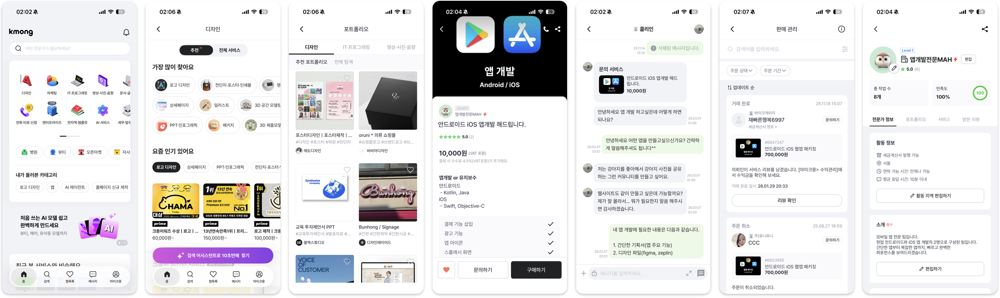
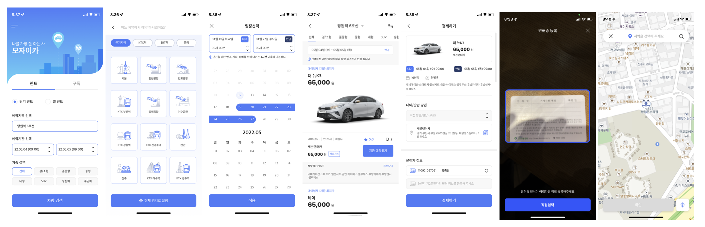
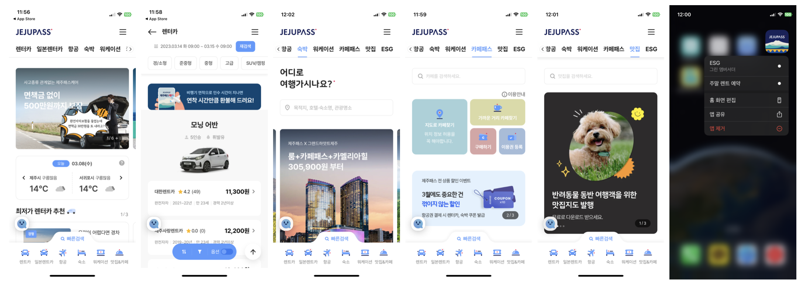
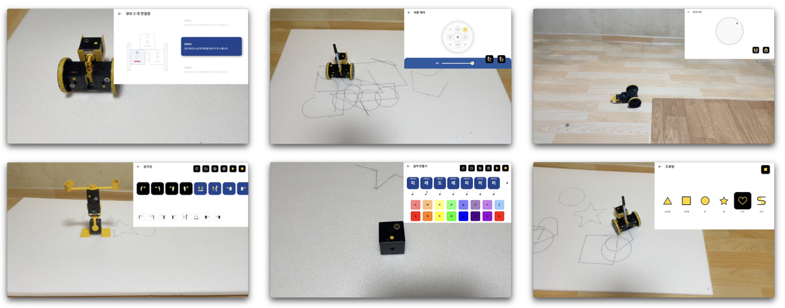
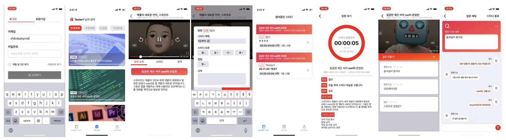
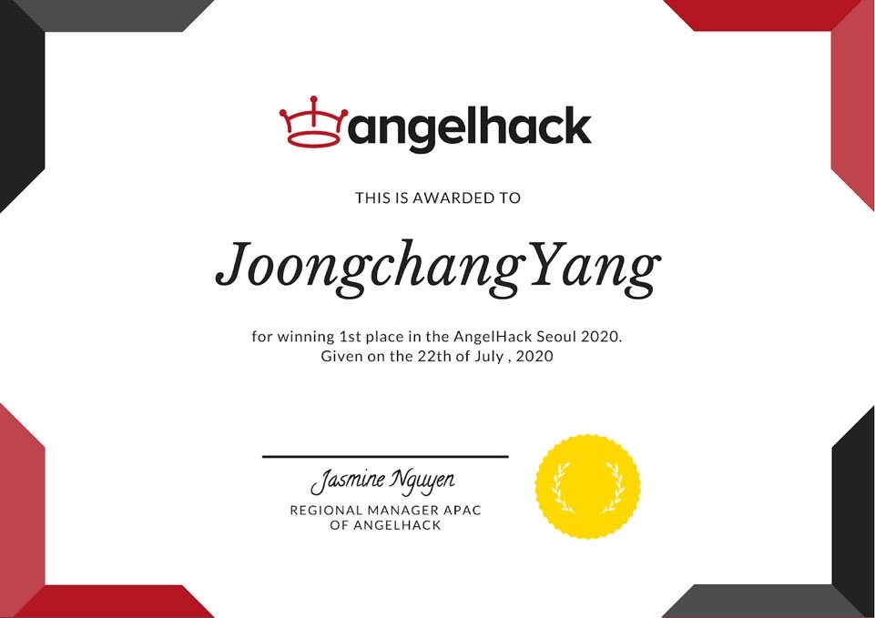
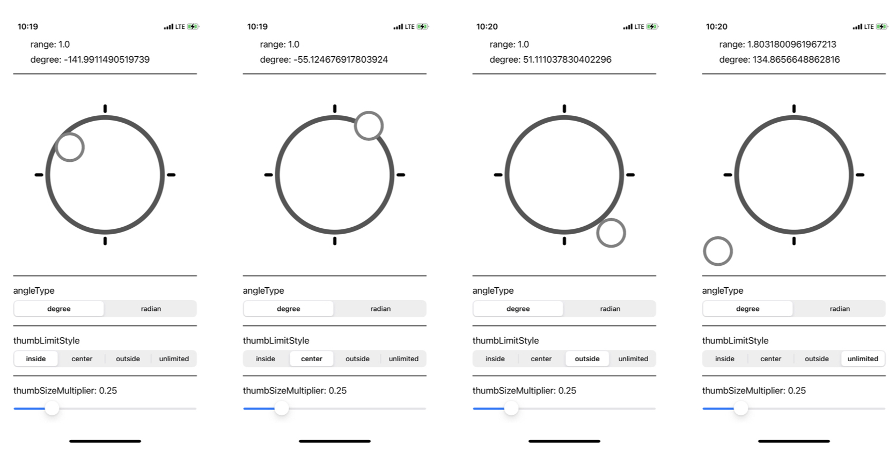

# 양중창

> iOS Developer

- **Email**: didwndckd@gmail.com
- **Phone**: 010-3334-9929
- **GitHub**: https://github.com/didwndckd

## 소개

서비스 규모가 커지면서 발생하는 구조적 문제를 분석하고 개선하는 것을 즐기는 iOS 개발자입니다.
Tuist 기반 모듈화, 아키텍처 리팩토링, 레거시 마이그레이션을 통해 코드베이스의 유지보수성과 확장성을 높이는 작업을 수행해왔습니다.
복잡한 서비스 환경에서도 안정적으로 동작하는 구조를 설계하고 코드의 의도와 책임이 명확한 구현을 지향합니다.

- 사용 언어: Swift, Objective-C
- 아키텍처/패턴: Clean Architecture, MVVM, Router
- UI: UIKit, SwiftUI, Storyboard
- 비동기/반응형: RxSwift, Combine, Swift Concurrency
- 모듈화: Tuist
- 테스트: XCTest, Swift Testing
- 분석/운영: Amplitude, Hackle, Firebase (Crashlytics, Analytics)
- 업무 툴: Slack, Jira, Confluence, Figma
- 형상관리: Git, Github, GitLab

## 경력 (6년차)

### (주)크몽

> 2023.07 ~ 재직중 (2년 8개월)

프리랜서/아웃소싱 플랫폼 (MAU 300만, 누적 거래 640만 건 이상)
iOS 팀 4명 규모 조직에서 iOS 앱 약 36만 LOC 코드베이스 개발 및 운영

#### 모듈화 아키텍처 설계 및 도입 (Tuist)
- 36만 LOC 규모 코드베이스에서 의존성 복잡도와 빌드 관리 문제 해결을 위해 도입
- Domain, Data 레이어 분리로 비즈니스 로직과 데이터 계층 격리
- Feature, Foundation, UIFoundation, DesignSystem 등 역할 기반 모듈 분리
- Micro Feature Architecture로 확장 가능한 구조적 기반 마련
- Tuist를 활용해 모듈 의존성과 빌드 환경 관리
- Mach-O 분석을 통해 Static/Dynamic 링킹 기준 수립
  - 자세한 내용은 [Mach-O 분석](https://github.com/didwndckd/TIL/tree/master/XcodeBuildSystem/Mach-O)을 참고해주세요.
- 모듈 단위 빌드 및 테스트가 가능해져 개발 피드백 루프 단축
- Domain, Presentation Layer 대상 Unit Test 작성으로 핵심 로직 검증 체계 확보

#### Amplitude · Hackle · Firebase를 활용한 데이터 기반 운영 경험
- Amplitude로 사용자 행동 이벤트 로깅 및 분석
- Hackle을 통한 A/B 테스트, Feature Flag, Remote Config 운영
- Firebase Crashlytics로 크래시 리포트 분석 및 원인 해결

#### 실시간 채팅(WebSocket) 아키텍처 개선
- Delegate 패턴에서 Combine 기반 Pub/Sub 구조로 전환하여 다중 화면 동시 이벤트 구독 지원
- 앱 생명주기 연동 WebSocket 자동 연결/해제로 백그라운드 리소스 낭비 제거
- `DiffableDataSource` 도입과 비활성 상태 이벤트 버퍼링으로 메시지 UI 업데이트 안정화
- 인덱스 불일치로 인한 채팅 화면 크래시 **0건으로 개선**

#### 화면 이동 관리를 위한 Router 패턴 도입
- 모듈 간 화면 이동이 불가능한 구조를 해결하기 위해 도입
- 의존성 주입 기반 설계로 테스트 가능한 구조 확보
- 화면 이동 의존성을 Router로 집중시켜 모듈 간 순환 참조 방지
- ViewController에 분산되어 있던 화면 전환 로직을 Router로 일원화
- SwiftUI, UIKit 화면 이동 로직을 통합 관리할 수 있는 구조 설계
- 바텀 시트, 툴팁 등 커스텀 트랜지션 지원

#### Endpoint 패턴 도입으로 API 관리 구조 개선
- 기존 Moya TargetType enum 방식에서 API별 개별 Endpoint struct 기반 구조로 전환
- Endpoint 프로토콜을 정의하고 각 API가 Endpoint 프로토콜을 채택하는 구조로 설계
- associatedtype 기반 타입 시스템을 활용해 API와 ResponseModel 매칭을 컴파일 타임에 검증
- 요청 정보가 하나의 struct에 응집되어 API 히스토리 파악과 유지보수 용이

#### 디자인 시스템 모듈 구축
- Atomic Design 기반으로 버튼, 텍스트필드 등 공통 UI 컴포넌트를 독립 모듈로 설계
- Presentation Layer에서 DesignSystem 모듈에 의존하여 UI 일관성 확보
- 디자이너 피드백을 위한 데모앱 모듈 구축

#### 네트워크 에러 모델 통합
- Presentation Layer에서 API 버전별 에러를 직접 알고 분기해야 하는 문제 해결
- API 버전별(v4, v5, MSA) 상이한 에러 모델을 Data Layer에서 단일 에러 타입으로 통합
- 필요시 Domain Layer에 에러를 정의하여 Presentation Layer에서 API 버전을 알 필요 없는 구조로 개선

#### 서비스 카드 모델 통합 및 UI 로직 구조 개선
- 파싱 모델·도메인 모델이 혼재하여 분산되어 있던 서비스 목록 모델을 단일 모델로 통합
- 통합 모델 기반의 ViewModel 신규 작성으로 각 화면에 중복되어 있던 서비스 카드 로직 통합
- 화면별로 상이한 서비스 카드 표시 요구사항을 SwiftUI EnvironmentKey 기반으로 전환하여 10개 이상 화면에 유연하게 대응

#### 검색 전면 리뉴얼 및 고도화
- 검색 홈·검색 결과·검색 필터 화면을 UIKit/Storyboard에서 SwiftUI + Clean Architecture 기반으로 전면 재구축
- Feature Flag 기반 점진적 배포 후 2스프린트 모니터링을 거쳐 구 화면 제거
- 검색 필터 A/B 테스트 설계 및 적용, 예산 필터 추가로 구매 전환율 개선 실험
- 검색 홈·검색 결과·검색 필터·전문가 검색 통합을 총 48개 PR로 분리하여 단계적으로 진행

#### 전문가 프로필 화면 전면 개편 (Claude Code 활용)
- SwiftUI + Clean Architecture 기반으로 재구축
- Spec / Plan 문서 기반으로 127개 Task를 도출하여 단계적으로 진행
- Domain → Data → Presentation 순으로 구현하여 비즈니스 로직을 UI와 독립적으로 먼저 확립
- 32개 PR로 분리하여 진행

### (주)캐플릭스

> 2020.09 ~ 2023.06 (2년 9개월)

iOS 팀 2명 규모 조직에서 iOS 앱 개발 및 운영

#### 모자이카

렌터카 픽업/반납 서비스

- 앱 전체 리뉴얼 주도
  - 기획 단계부터 참여하여 전체 화면 UI 및 기능 재설계
  - 기존 VIPER 패턴이 소규모 팀에서 과도한 보일러플레이트를 유발한다고 판단, MVVM으로 전환하여 개발 속도 개선
- RxSwift 기반 네트워크 통신 모듈 설계
  - Moya 도입으로 API를 타입 기반으로 관리하는 구조 확립
  - Observable 확장으로 에러 핸들링을 일관된 인터페이스로 통합
- 전체 화면 메모리 누수 제거
  - 화면 이동 방식의 구조적 결함으로 모든 화면에 순환 참조가 존재하던 문제를 분석 및 해결
  - `WKUserContentController`의 강한 참조 문제를 프록시 패턴으로 해결

#### 제주패스

항공, 숙박, 렌터카 가격 비교/예약 서비스

- 로그인 모듈 설계 (ID, SNS 간편 로그인, 생체 인증)
- `Moya.PluginType` 기반 토큰 자동 갱신 플러그인 개발
- FCM 푸시, 다이나믹 링크, 퀵 액션 등 앱 진입점 처리 모듈 통합 설계
- Xcode 파일 생성 템플릿을 작성하여 팀 내 개발 컨벤션 통일에 기여

### RoboRisen (외주 프로젝트)

> 2021.10.21 ~ 2021.12.29 (2개월)

### 코딩로비

블루투스 연결을 통해 로봇을 제어하며 놀 수 있는 아이들을 위한 코딩 교육 앱

**시연 영상**: https://www.youtube.com/watch?v=2jRoFh67k18

- RxSwift, MVVM 패턴, 스토리보드 사용
- `CoreBluetooth`를 사용하여 큐브 연결과 데이터 입출력 제어
- 블루투스 데이터 전송 간 `Queue`를 구현하여 데이터를 안전하게 전송할 수 있도록 구현
- 컨트롤러 프로토콜(버튼, 조이스틱, 움직임 등)을 정의하고 로봇 구조체에 필요한 프로토콜들을 채택하여 구현
- 각도 값, 중앙에서 떨어진 정도를 알 수 있는 커스텀 조이스틱 뷰 구현

## 수상 경력

### AngelHack Seoul 2020

> 2020.07.13 ~ 2020.07.19

원격 학습 환경에서의 완주율 향상을 주제로 온라인 스터디 앱을 개발하여 **우승**

- 참여 인원: 5명 (iOS 3명, 디자인 2명)

**GitHub**: https://github.com/didwndckd/AngelHack2020

**시연 영상**: https://www.youtube.com/watch?v=k_3of0Qic5c

## 오픈소스 프로젝트

### JCJoystick

> 2022.04.14 ~ 2022.04.30

게임이나 컨트롤러 등에 사용 가능한 조이스틱 뷰

**GitHub**: https://github.com/didwndckd/JCJoystick

 

- CocoaPods 배포
- 사용자 터치 이벤트를 따라 뷰를 이동시키고 각도값과 중간지점에서 떨어진 정도를 `delegate`를 통해 전달
- 터치 이벤트가 가이드 뷰를 벗어나면 현재 터치 포인트 방향의 외곽 지점으로 위치를 조정하여 부드럽게 움직이는 조이스틱 구현

## 학력

### 국가평생교육진흥원 학점은행

> 2019.09 ~ 2023.08

- 컴퓨터공학(4.1/4.5)